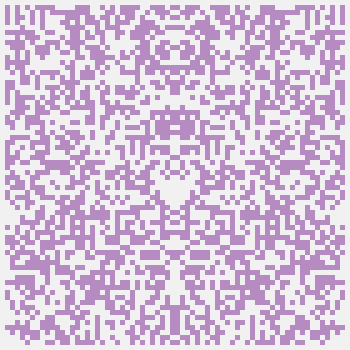

# Github avatars generator

<p align="center">
  <div style="display: flex; align-items: flex-start;">
    
    
    
  </div>
</p>

## Usage

### Install packages
```
pip install -r requirements.txt
```

### Create random avatar

```python
from gh_avatars import Avatar

ava = Avatar()
image = ava.generate()

image.save('file.png', 'PNG')
```

### Create nick-based avatar with params

```python
from gh_avatars import Avatar

ava = Avatar(
    background='#f2f1f2',  # HEX-color string only
    resolution=12, # Width of pixel grid
    size=120  # Multiple of resolution
)

image = ava.generate(
    nick='codedragon2002',
    color='#084C61'  # HEX-color string only
)

image.save('codedragon2002.png', 'PNG')
```
